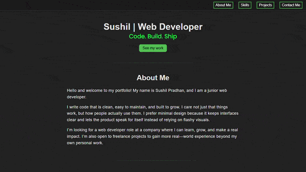

# Portfolio — Personal Website

Originally my FreeCodeCamp HTML/CSS capstone, this portfolio has evolved into a showcase of vanilla JavaScript integration. It features dynamic elements like a hero typewriter animation and asynchronous form handling. By using the Fetch API to process FormData via promises, I replaced standard redirects with a custom, seamless user experience. This project documents my transition from static layouts to functional programming.

**Live demo:** https://pradhansushil.github.io/portfolio/

---

## Table of Contents

- [Features](#features)
- [Site Architecture](#site-architecture)
- [Tech Stack](#tech-stack)
- [Developer Workflow & Standards](#developer-workflow--standards)
- [Key Learnings](#key-learnings)
- [Installation](#installation)
- [License](#license)

---

## Features

### Navigation

- **Sticky Header:** Remains visible during scrolling for easy access to links.
- **Smooth Scrolling:** Anchor links provide a seamless transition between sections.
- **Responsive Mobile Menu:** Built a hamburger menu using a CSS-only checkbox toggle.
- **Social Links:** Consistently placed in both the header and footer.

### Hero Section

- **Identity:** Features a prominent title: "Sushil | Web Developer".
- **Typewriter Animation:** Engineered a "Code. Build. Ship." tagline effect using recursive `setTimeout` logic.
- **Call to Action:** A "See my work" button that directs users to the project grid.

### About Me

- **Content Strategy:** Three paragraphs introducing development philosophy, code quality commitment, and career goals.
- **Readability:** Content is constrained to a `max-width` of 50rem to ensure an optimal reading experience on large screens.

### Skills

- **Categorization:** Expertise is organized into Soft Skills and Technical Skills.
- **Visual Hierarchy:** The stack includes HTML, CSS, Responsive Design, Git & Version Control, and JavaScript.
- **Focus Highlight:** JavaScript is visually distinguished with a dashed border and italic text to highlight it as the primary learning focus.

### Projects

- **Responsive Layout:** Designed a CSS Grid layout for project cards that adapts fluidly from desktop to mobile.
- **Card Design:** Each card features a project screenshot, a list of the tech stack used, and links to live demos and GitHub repositories.
- **Featured Work:** Highlights the **Product Landing Page**, **Development Blog**, and **Pump & Iron** projects.

### Contact Form

- **Validation:** A custom validation system in `contact.js` checks for empty fields and verifies email formats before submission.
- **Asynchronous Handling:** Integrated with **Formspree** using `fetch()` to submit forms without a page reload.
- **User Feedback:** Custom success and error states replace the form upon submission to provide immediate feedback.

### Footer

- **Dynamic Date:** JavaScript ensures the copyright year updates automatically.
- **Clean DOM:** The GitHub profile icon is dynamically injected via JavaScript to keep the HTML markup clean.

---

## Site Architecture

This is a strictly static website. The browser loads `index.html`, applies `styles.css`, and executes modular JavaScript scripts.

### File Structure

portfolio/
├── index.html # Main entry point
├── styles.css # Centralized styling logic
├── src/
│ ├── animatedLetters.js # Hero typewriter effect logic
│ ├── contact.js # Form validation and API handling
│ └── footer.js # Dynamic date and icon injection
├── images/
│ ├── product-landing-page.png
│ ├── pump-iron.gif
│ └── the-sushil's-desk.png
├── .gitignore # Keeps dev notes out of the repo
└── LICENSE.txt # Copyright notice

---

## Tech Stack

- **HTML5** — Semantic markup and accessibility best practices.
- **CSS3** — Flexbox, CSS Grid, and Custom Properties (variables).
- **Vanilla JavaScript (ES6+)** — DOM manipulation and the `fetch` API.
- **Google Fonts** — "Poppins" for a modern, clean aesthetic.
- **Font Awesome 6.7.2** — Scalable vector icons.
- **Formspree** — Backend-as-a-service for form handling.
- **GitHub Pages** — Static hosting.

---

## Developer Workflow & Standards

### My Coding Approach

I utilized AI as a mentor to help me understand logic "under the hood" rather than simply copying code, ensuring a deep comprehension of the implementation.

### Version Control

I used Git throughout the entire development lifecycle and maintain a clean repository history by utilizing a `.gitignore` file.

---

## Installation

Since this project uses pure HTML, CSS, and JavaScript with no build dependencies, you can run it locally in seconds:

1. Clone the repository:
   git clone https://github.com/pradhansushil/portfolio
   cd portfolio

2. Open `index.html` in your browser.

---

## License

All rights reserved.
